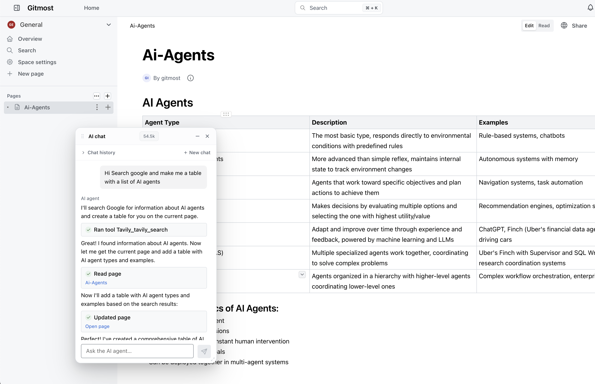

<div align="center">
    <h1><b>Gitmost</b></h1>
    <p>
        Совместная вики и система документации с открытым исходным кодом.
        <br />
        Полностью открытый community-форк <a href="https://github.com/docmost/docmost">Docmost</a>.
    </p>
</div>
<br />

[English](README.md) · **Русский**

## Об этом форке

**Gitmost** — это community-форк [Docmost](https://github.com/docmost/docmost),
открытой системы для совместной работы над вики и документацией.

Цель форка — **сборка на 100% открытая, только под AGPL, без кода Enterprise-редакции (EE)**:

- **Никакого EE-кода.** Весь проприетарный код Enterprise-редакции удалён — приватный
  сабмодуль `apps/server/src/ee`, каталог `apps/client/src/ee` (201 файл) и пакет
  `packages/ee`. Никаких лицензионных ограничений: все функции доступны всем.
- **Замены написаны с нуля.** Функции, которые раньше были скрыты за enterprise-лицензией
  (например, резолв комментариев, чат с AI-агентом, сервер `/mcp`), переписаны с нуля поверх
  community-кодовой базы. EE-код не переиспользуется, нет проверок entitlement и feature-флагов.
- **Никакого навязывания.** В интерфейсе нигде нет плашек «купите лицензию» / «перейдите на
  Enterprise», напоминаний о триале и заглушек на месте заблокированных функций.
- Аутентификация — обычная пара email + пароль (без SSO/LDAP/облака/биллинга).

## Чем отличается от Docmost

| Изменение | Подробности |
| --- | --- |
| **Удалён EE-код** | Вырезан весь код Enterprise-редакции на клиенте и сервере; это чистая community/AGPL-сборка без лицензионных проверок. |
| **Резолв комментариев** | Переписан с нуля как community-функция (резолв / переоткрытие с вкладками «Открытые» / «Решённые»). EE-код не используется, доступно любому, кто может комментировать. |
| **Встроенный MCP-сервер** | Community MCP-сервер (`@docmost/mcp`, 39 инструментов) отдаётся по HTTP на `/mcp` — без enterprise-лицензии. Заменяет удалённый лицензируемый EE MCP. |
| **Чат с AI-агентом** | Встроенный чат с AI-агентом по содержимому вики, написанный с нуля как community-функция — без enterprise-лицензии. Агент читает и редактирует страницы от вашего имени (в рамках ваших прав), с полнотекстовым + векторным (RAG) поиском и опциональным доступом в интернет через внешние MCP-серверы. |
| **Ребрендинг** | Логотип / название приложения изменены с *Docmost* на *Gitmost*. |
| **Компактное дерево страниц** | Отступ дерева страниц по умолчанию уменьшен с 16px до 8px на уровень вложенности. |
| **Сохранение состояния дерева страниц** | Дерево страниц в сайдбаре запоминает, какие узлы вы раскрыли/свернули, между перезагрузками — состояние хранится в браузере (localStorage) отдельно для каждой пары воркспейс + пользователь, чтобы аккаунты в одном браузере не пересекались. В оригинальном Docmost дерево сбрасывается при каждой перезагрузке. |
| **CI / образы** | Release-CI публикует контейнерные образы в GHCR (`ghcr.io/vvzvlad/gitmost`) через встроенный `GITHUB_TOKEN` вместо Docker Hub. |

### Встроенный MCP-сервер

В Gitmost есть **наш собственный MCP-сервер** — [docmost-mcp](https://github.com/vvzvlad/docmost-mcp),
который мы написали сами, — **встроенный прямо в приложение** и доступный на `/mcp`. Он даёт
**39 agent-native инструментов**: точечное редактирование по блокам (patch / insert / delete
по id), find/replace с сохранением структуры, скриптовые трансформации `(doc) => doc` с
предпросмотром диффа, структурное редактирование таблиц, история версий с диффом /
восстановлением, комментарии, изображения и ссылки на шаринг — всё применяется через слой
real-time-коллаборации Docmost, поэтому запись никогда не затирает параллельную правку
человека.

**Лучше, чем родной MCP у Docmost.** Встроенный MCP у Docmost — enterprise-функция, и его
инструменты примитивные: прочитать страницу как Markdown, создать / переместить / удалить
страницу, заменить страницу целиком. Наш сделан под то, как агент реально редактирует:
адресовать один блок и пропатчить его или *запрограммировать* изменение, а не гонять
документ на ~100 КБ через модель ради каждой мелкой правки. И enterprise-лицензия не нужна.

| | **`/mcp` в Gitmost (наш docmost-mcp)** | Родной MCP у Docmost |
| --- | :---: | :---: |
| **Enterprise-лицензия** | Не нужна | Нужна |
| **Инструменты** | 39, agent-native | Примитивные (Markdown, CRUD страниц, замена целиком) |
| **Правки по блокам / find-replace / скриптовые трансформации** | ✅ | — |
| **Структурное редактирование таблиц, дифф / восстановление версий** | ✅ | — |
| **Комментарии, изображения, ссылки на шаринг** | ✅ | — |
| **Безопасная запись через real-time-коллаборацию (без затирания)** | ✅ | — |

**Это тот же сервер, что и отдельный docmost-mcp, — просто встроенный.** Это ровно тот самый
[docmost-mcp](https://github.com/vvzvlad/docmost-mcp), который можно запускать и отдельно;
от встраивания он не становится «мощнее» — просто не нужно ставить и держать отдельный
процесс. Админ включает его одним переключателем в **Настройки воркспейса → AI**, а
любой MCP-клиент указывает на `${APP_URL}/mcp`.

### Чат с AI-агентом

В Gitmost есть **встроенный чат с AI-агентом** по содержимому вики — написанный с нуля
как community-функция, без enterprise-лицензии. Открывается из шапки страницы; агент умеет
**читать и редактировать** ваш воркспейс от вашего имени:

- **Полный набор инструментов чтения + записи (~40 штук).** Поиск и чтение страниц,
  точечные правки по блокам и в таблицах, создание / переименование / перемещение страниц,
  дифф и восстановление версий, создание / резолв комментариев — каждое действие
  выполняется под *вашими* правами (Docmost CASL), поэтому агент не видит и не меняет
  ничего, чего не могли бы вы сами.
- **Безопасность по умолчанию.** Агенту доступны только **обратимые** операции (история
  версий + корзина); перманентное удаление не экспонируется. Правки агента помечаются в
  истории версий бейджем «AI-агент» со ссылкой на чат.
- **Поиск по вашему контенту.** Полнотекстовый поиск плюс опциональный векторный (RAG)
  семантический поиск по страницам.
- **Доступ в интернет через внешние MCP.** Админ может подключить внешние MCP-серверы
  (например, Tavily), чтобы дать агенту веб-поиск / доступ в интернет.
- **Своя модель.** OpenAI-совместимый эндпоинт — OpenAI, OpenRouter, локальный Ollama или
  любой self-hosted-сервер — плюс модель и API-ключ настраиваются в
  **Настройки воркспейса → AI**. Ключ шифруется и никогда не покидает сервер.

## Дорожная карта

### Готово

- ✅ **MCP-сервер** — встроенный community MCP-сервер на `/mcp`.
- ✅ **Приложение для macOS** — нативное приложение для macOS ([gitmost-app](https://github.com/vvzvlad/gitmost-app)), встраивающее UI с вкладками для нескольких серверов.
- ✅ **AI-чат** — встроенный чат с AI-агентом по содержимому вики (чтение + запись, RAG-поиск, настраиваемый провайдер, опциональный доступ в интернет через внешние MCP).
- ✅ **Голосовая диктовка** — кнопка-микрофон в чате AI-агента и в редакторе страниц; аудио распознаётся на сервере (Whisper / OpenAI-совместимый STT) через AI-провайдер воркспейса, с тумблером админа для показа/скрытия.
- ✅ **Шаблоны страниц** — пометить страницу шаблоном и вставлять её содержимое живой ссылкой в другие страницы; правки шаблона распространяются на все места вставки (whole-page-транслюзия поверх существующих synced-блоков).
- ✅ **AI-ассистент на публичных шарах** — анонимный зритель расшаренной страницы может спросить AI-агента, который ищет строго по дереву этой шары (read-only, share-scoped поиск), за тумблером воркспейса.
- ✅ **Сноски** — сноски академического вида: нумерованная ссылка-надстрочник прямо в тексте (читается на месте во всплывающем окне по наведению), а текст сноски живёт реальным редактируемым блоком внизу страницы; авто-нумерация, безопасна для совместного редактирования, переживает экспорт/импорт Markdown и доступна AI-агенту / MCP.
- ✅ **Временные заметки** — пометьте заметку временной, и она автоматически уедет в корзину по истечении настраиваемого срока жизни воркспейса (по умолчанию 24 ч), если её предварительно не сделать постоянной; создать такую можно в один клик с домашнего экрана, с обзора любого пространства или из сайдбара пространства, а на открытой заметке есть баннер «Сделать постоянной».

### В процессе

- 🚧 **Синхронизация с Git** — двусторонняя синхронизация страниц с Git-репозиторием.

### В планах

- 🔭 **Комментарии зрителей** — возможность комментировать для пользователей с доступом только на чтение.
- 🔭 **Защищённые паролем страницы** — защита отдельных страниц / шар паролем.
- 🔭 **Приложение для Windows / Linux** — нативное десктоп-приложение для Windows и Linux.
- 🔭 **Мобильное приложение** — мобильные приложения (iOS обязательно, Android как пойдёт) на базе существующей адаптивной веб-версии и редактора через обёртку Capacitor; оффлайн запланирован на будущее. См. [issue #195](https://gitea.vvzvlad.xyz/vvzvlad/gitmost/issues/195).
- 🔭 **Офлайн-режим** — офлайн-синхронизация и поддержка PWA.
- 🔭 **Улучшения редактора и UX** — блоки внутри таблиц (списки, чек-листы), колоночная вёрстка, дополнительные уровни заголовков, highlight-блоки, кастомные эмодзи в callout-ах, плавающие изображения, anchor-ссылки на упоминания страниц, тоглы (ширина шары, aside/сайдбар, spellcheck, лигатуры), санитизация экспорта дерева спейса и mentions в хлебных крошках.

## С чего начать

Gitmost повторяет процесс установки upstream-Docmost. Инструкции по self-hosting и разработке
смотрите в [документации](https://docmost.com/docs) Docmost; где это применимо, заменяйте образ
`docmost/docmost` на `ghcr.io/vvzvlad/gitmost`.

## Миграция с Docmost

Схема БД Gitmost — это **строгий superset** схемы Docmost. Все Gitmost-специфичные миграции только
**добавляют** новые таблицы (`page_embeddings`, `ai_chats`, `ai_chat_messages`,
`ai_provider_credentials`, `ai_mcp_servers`) и **nullable**-колонки — они никогда не удаляют и не
переписывают существующие данные Docmost. Миграции применяются автоматически при старте, поэтому
миграция существующего инстанса Docmost — это по сути **замена двух образов**.

Единственное жёсткое требование — образ БД: RAG-хранилище AI-агента использует расширение
[pgvector](https://github.com/pgvector/pgvector) (`CREATE EXTENSION vector`), которого нет в
стоковом образе `postgres`. Замените его на `pgvector/pgvector:pgNN` — это тот же ванильный
Postgres со встроенным pgvector, собранный на базе официального образа `postgres` и полностью
data-совместимый с ним.

### С текущего Docmost на Postgres 18

Если ваш Docmost уже работает на `postgres:18`, это чистая замена in-place — без
dump/restore, существующий каталог данных переиспользуется как есть:

```diff
 services:
   docmost:
-    image: docmost/docmost:latest
+    image: ghcr.io/vvzvlad/gitmost:latest
     ...
   db:
-    image: postgres:18
+    image: pgvector/pgvector:pg18
```

`APP_SECRET`, `DATABASE_URL`, `REDIS_URL` и том сторейджа остаются прежними. При первом запуске
новые миграции применяются поверх вашей схемы (`CREATE EXTENSION vector` плюс таблицы
`page_embeddings` и AI-таблицы); следите в логах за строками `Migration "..." executed successfully`.

> ⚠️ **Никогда не меняйте `APP_SECRET` после установки.** Он выполняет двойную роль: подписывает JWT
> *и* служит материалом для ключа AES-256-GCM, которым шифруются сохранённые ключи AI-провайдеров
> (API-ключи). Смена секрета сделает все сохранённые AI-ключи нерасшифровываемыми (придётся вводить
> их заново в настройках AI) и инвалидирует все текущие сессии. Задайте его один раз, держите
> неизменным и бэкапьте вместе с базой данных.


## Возможности

- Совместная работа в реальном времени
- Диаграммы (Draw.io, Excalidraw и Mermaid)
- Пространства (Spaces)
- Управление правами доступа
- Группы
- Комментарии (с резолвом / переоткрытием)
- История страниц
- Поиск
- Вложения файлов
- Встраивания (Airtable, Loom, Miro и другие)
- Переводы (10+ языков)
- Встроенный MCP-сервер (`/mcp`)
- Чат с AI-агентом по вики (чтение + запись, RAG-поиск, внешние MCP / доступ в интернет)

### Скриншоты

<p align="center">



</p>

### Лицензия

Gitmost распространяется под открытой лицензией AGPL 3.0.

В отличие от upstream-Docmost, этот форк **не содержит кода Enterprise-редакции** — каталоги
`apps/server/src/ee`, `apps/client/src/ee` и `packages/ee` удалены, поэтому файлов под
enterprise-лицензией здесь нет.

### Благодарности

Gitmost основан на [Docmost](https://github.com/docmost/docmost) от команды Docmost. Огромное
спасибо им за оригинальный открытый проект.


[Crowdin](https://crowdin.com/) — за доступ к их платформе локализации.


[Algolia](https://www.algolia.com/) — за полнотекстовый поиск по документации.
